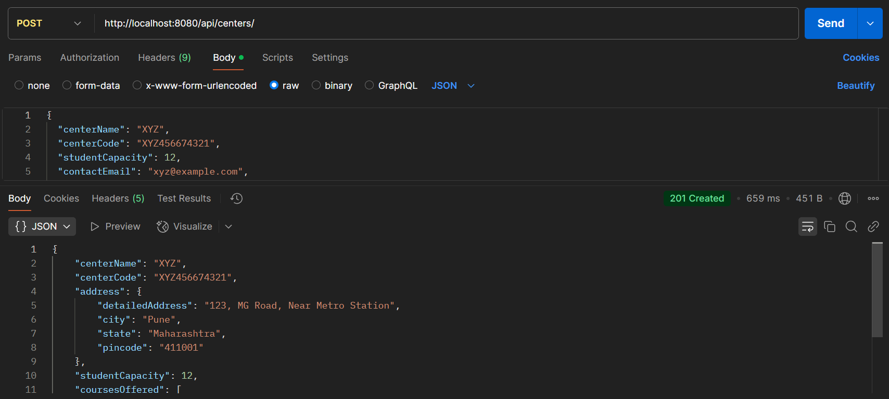
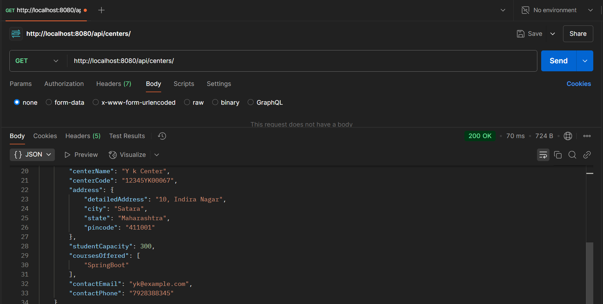
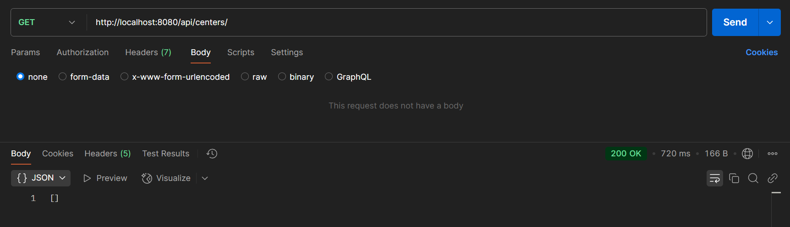

# Training Centers Registry API

## Overview
This project is an MVP for a registry of government-funded training centers. It provides APIs to create and retrieve training center information.

## Technologies Used
- Java
- Spring Boot
- Spring Data JPA
- PostgreSQL

## Setup Instructions

### Prerequisites
- Install Java 17 or later
- Install PostgreSQL
- Install Maven

### Configuration
Update your terminal environment variables before running the application:

```sh
export DB_HOST=your_db_host
export DB_PORT=your_db_port
export DB_NAME=your_db_name
export DB_USER=your_db_username
export DB_PASSWORD=your_db_password
```

Alternatively, you can update `application.properties`:

```
spring.application.name=Training Centers Registry

spring.datasource.url=jdbc:postgresql://${DB_HOST}:${DB_PORT}/${DB_NAME}
spring.datasource.username=${DB_USER}
spring.datasource.password=${DB_PASSWORD}

spring.datasource.driver-class-name=org.postgresql.Driver

spring.jpa.hibernate.ddl-auto=update
spring.jpa.properties.hibernate.dialect=org.hibernate.dialect.PostgreSQLDialect
```

### Running the Application
1. Clone the repository:
   ```sh
   git clone https://github.com/tulsipatil/Backend_Traini8_TulsiPatil.git
   ```
2. Build the project:
   ```sh
   mvn clean install
   ```
3. Run the application:
   ```sh
   mvn spring-boot:run
   ```

## API Endpoints

### 1. Create a Training Center (POST `/api/centers`)
- Validates and saves a new training center in the database.
- Returns the saved training center details.
- Handles validation errors with appropriate messages.

### 2. Get All Training Centers (GET `/api/centers`)
- Returns a list of all stored training centers.
- Returns an empty list if no training centers exist.

## Error Handling
- This project uses a Global Exception Handler to manage validation errors and return structured responses.
- Handles cases like invalid center code, email, and phone number.

## Postman API Screenshots

### Training Center Created Successfully


### Exception on Invalid Center Code


### Get All Centers


### Empty List of Centers - when no center exists


